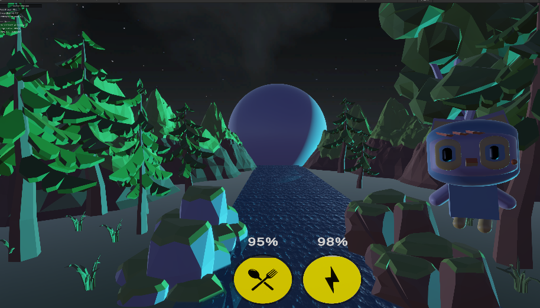
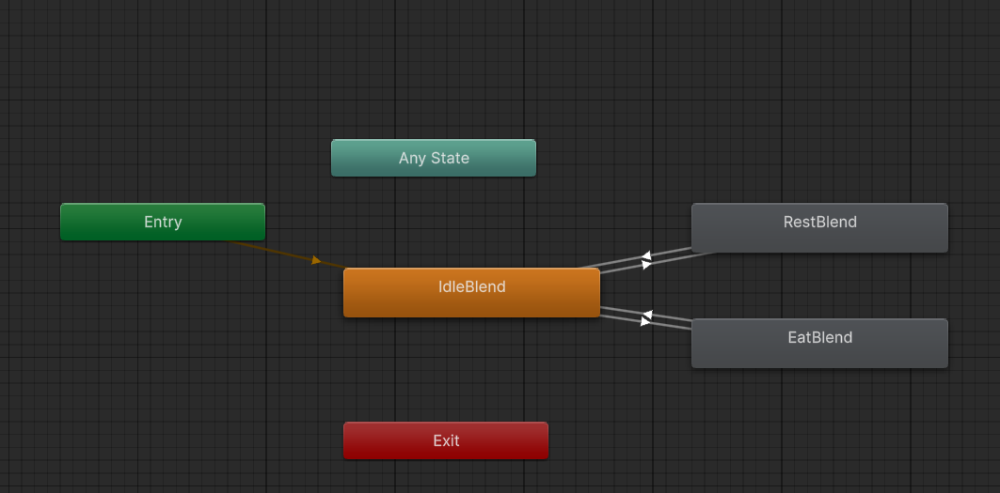
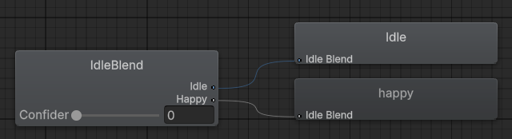
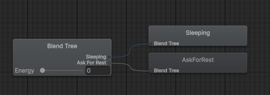
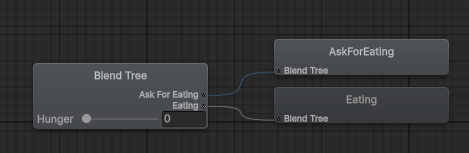
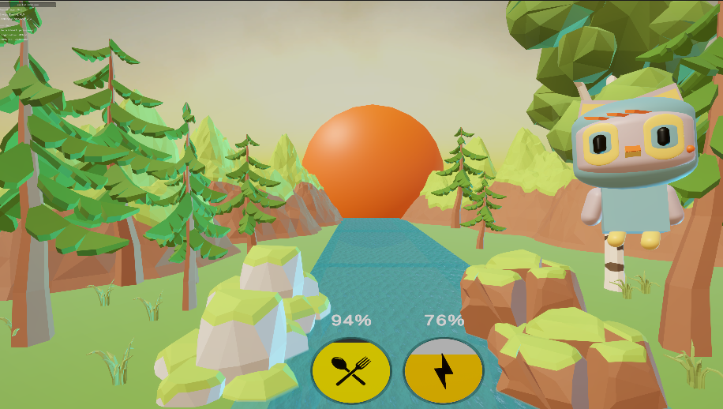

# VirtualPet 🦉

A virtual pet developed by **Yago Phellipe Matos Lopes** for the **Game Systems** course at **Saxion University**. The project explores how a pet's needs, mood, and personality can be communicated through animation, player interaction, and environmental feedback.

Meet a small, calm, slightly shy owl. Feed her, help her rest, and watch her hunger, energy, and confidence shape her behavior. The intended experience is peaceful and nurturing, encouraging a sense of connection and responsibility for a nocturnal companion.

## Project document

📄 **[Read the complete Game System - PET document](docs/game-system-pet.pdf)**

The original academic report is included in this repository. It covers the personality questionnaire, state machine, player interface, playtesting, and planned improvements. All six images in this README were extracted from that document.

This README brings together the design described in the report and the implementation found in the repository. Differences between the intended design and current behavior are identified below.

## Personality and emotional expression

| Aspect | Design intention described in the report |
| --- | --- |
| General disposition | Calm and slightly shy, becoming curious and playful when comfortable. |
| Social interaction | Responds positively to attention and food, building a bond with the player. |
| Hunger | Seeks attention through gentle wing movements and upward looks. |
| Tiredness | Becomes slower and less responsive, with heavy eyelids and softer movements. |
| Well-being | Shows excitement and satisfaction through more expressive, faster wing movements. |
| Unique quirk | Tilts her head when curious and slowly stretches her wings when relaxed. |

These traits guide the owl's visual expression. The current system represents her condition through three numerical attributes and their animations; curiosity, sadness, and attachment do not have separate numerical systems.

## How the mood system works

[`PetControllerSimple.cs`](Assets/PetControllerSimple.cs) continuously updates three attributes, clamping each to **0–100**:

| Attribute | Meaning | Initial value in `FirstScene` |
| --- | --- | --- |
| `Hunger` | Fullness: **100 = full**, **0 = starving**. Despite its name, a higher value means less hunger. | 100 |
| `Energy` | Rest level: **100 = fully rested**, **0 = exhausted**. | 100 |
| `Confidence` | Controls the blend between neutral and happy animation. | 50 |

Over time, fullness decreases by **1 point per second** and confidence decreases by **0.2 points per second**. Energy decreases by **0.5 points per second**, slowing to **0.2 points per second** when it falls below 30. These rates are configurable in the Inspector.

### Player interactions

The following changes apply to one call of each action with the values saved in `FirstScene`:

| Action | Fullness (`Hunger`) | Energy | Confidence |
| --- | --- | --- | --- |
| Feed (`Feed`) | +25 | −5 | +10 |
| Rest (`Sleep`) | −10 | +30 | +5 |

All results are clamped to 0–100. Caring for the owl increases confidence while introducing a trade-off between needs: eating consumes energy, and resting reduces fullness.

**Difference from the report:** the PDF describes continuous energy recovery during rest. In the current code, energy continues decreasing even in `RestBlend`; calling `Sleep()` restores it immediately. The button changes the attributes, and the Animator determines the resulting animation.

### State machine and Blend Trees

[`OwnController.controller`](Assets/Animations/OwnController.controller) contains three main states. Each uses a **Blend Tree** to mix two animations according to its controlling attribute.

| State | Controlling attribute | Animation reference points |
| --- | --- | --- |
| `IdleBlend` | `Confidence` | `Idle` at 0 → `Happy` at 100 |
| `EatBlend` | `Hunger` | `AskForEating` at 0 → `Eating` at 40 |
| `RestBlend` | `Energy` | `Sleeping` at 0 → `AskForRest` at 30 |

The configured transitions are:

| From | To | Condition |
| --- | --- | --- |
| `IdleBlend` | `EatBlend` | `Hunger < 40` |
| `EatBlend` | `IdleBlend` | `Hunger > 70` |
| `IdleBlend` | `RestBlend` | `Energy < 30` |
| `RestBlend` | `IdleBlend` | `Energy > 60` |

Different entry and exit thresholds prevent repeated switching around a single boundary. For example, after entering the eating state below 40, fullness must recover above 70 before the owl returns to idle. Transitions last 0.25 seconds and do not wait for the animation clip to finish.

There is no direct transition between `EatBlend` and `RestBlend`: both return through `IdleBlend`. In that state, the rest transition is listed before the eating transition. Confidence changes the neutral-to-happy blend inside `IdleBlend`, rather than triggering a separate happiness state.

**Mood: neutral ↔ happy**

**Rest: sleeping ↔ asking for rest**

**Food: asking for food ↔ eating**

The pet controller synchronizes `Hunger`, `Energy`, and `Confidence` with the Animator every frame and after interactions. Although the Animator asset also contains triggers, this script drives the system through those three float parameters.

## Interface, environment, and audio

The interface provides feeding and resting controls with need indicators. `PetUIManager` synchronizes the attributes with the UI, while `CircularStatusButton` updates fill amount, color, and an optional percentage label. Button scripts also support hover and click feedback.

The environment reinforces the owl's nocturnal identity. In [`DayNightCycleController.cs`](Assets/DayNightCycleController.cs), **the pet's energy drives the visual transition between day and night**. With inverted logic enabled, high energy corresponds to nighttime and low energy corresponds to daytime. Lighting and ambient audio volumes are interpolated, the skybox switches during the transition, and the sun and moon receive scale and transparency effects.

In `FirstScene`, the saved thresholds are **90 for night** and **80 for day**, with interpolation between them. The script declares defaults of 80 and 20, but the scene overrides those values. The current cycle therefore responds to energy; it is not an independent clock that changes the owl's tiredness.

[`PetAnimationAudioPlayer.cs`](Assets/PetAnimationAudioPlayer.cs) supports sounds associated with animation states or clips, with configurable volume, looping, and repeat intervals.

## Playtesting and evaluation

According to the report, **10 participants** tested the prototype for approximately **2–5 minutes** each. The questionnaire explored control clarity, animation readability, the relationship between attributes and visual expression, emotional response, and the day/night cycle.

- All participants reported that understanding how to let the owl rest or sleep was easy.
- Most could distinguish the animations and recognize their relationship to the internal states.
- Feedback emphasized relaxation, calmness, and responsibility for the owl.
- The day/night cycle was frequently mentioned as a favorite feature.
- Suggestions included additional interactions and a clearer visual connection between the environment and tiredness.

These findings summarize the qualitative results recorded in the PDF. Individual responses and a dataset for reproducing the analysis are not included in this repository.

Links recorded in the report: [playtest questionnaire](https://docs.google.com/forms/d/e/1FAIpQLSc7QUfxaQWBoJUeuQC-yTBPXFa5JxY3HLKu5dysT-yXjXbi6Q/viewform) · [game page on itch.io](https://yagophellipe.itch.io/owl-pet).

## Open the project

1. Add this repository's folder to **Unity Hub**.
2. Open it with **Unity 6000.1.2f1**, the version recorded in `ProjectSettings/ProjectVersion.txt`.
3. Allow Unity to import the assets and resolve packages. The project uses **Universal Render Pipeline (URP) 17.1.0**.
4. Open [`Assets/Scenes/FirstScene.unity`](Assets/Scenes/FirstScene.unity), the scene enabled in the build settings.
5. Enter **Play** mode and use the feeding and resting controls to observe changes in attributes, animation, and environment.

`MainScene.unity` is also included, but is disabled in the current build settings.

## Project structure

| File or folder | Responsibility |
| --- | --- |
| [`Assets/PetControllerSimple.cs`](Assets/PetControllerSimple.cs) | Needs, decay, feeding, resting, and Animator parameters. |
| [`Assets/Animations/`](Assets/Animations/) | Animation assets and the owl's state machine. |
| [`Assets/PetUIManager.cs`](Assets/PetUIManager.cs) | Synchronization between attributes and UI. |
| [`Assets/CircularStatusButton.cs`](Assets/CircularStatusButton.cs) | Fill and color indicators. |
| [`Assets/HoverAndClickButton.cs`](Assets/HoverAndClickButton.cs) | Button interaction and feedback. |
| [`Assets/DayNightCycleController.cs`](Assets/DayNightCycleController.cs) | Day/night environment driven by energy. |
| [`Assets/PetAnimationAudioPlayer.cs`](Assets/PetAnimationAudioPlayer.cs) | Sounds associated with animations. |
| [`docs/`](docs/) | Original academic report and README images. |

## Possible next steps

Suggestions for a future iteration, **not implemented as part of this documentation update**:

- **Continuous rest:** recover energy while the owl sleeps, bringing the behavior closer to the report's design.
- **First-time guidance:** briefly explain both controls and clarify that the `Hunger` indicator represents fullness.
- **Clearer need expression:** strengthen hunger and tiredness cues and the visual connection between energy and environment.
- **Additional interaction:** introduce petting or play to build confidence beyond feeding and resting.
- **Simultaneous needs:** review state priorities and transitions when both fullness and energy are low.

---

Academic Game Systems project · Saxion University · Yago Phellipe Matos Lopes.
